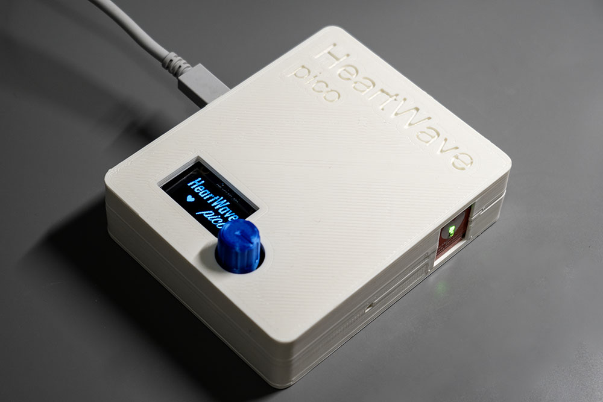
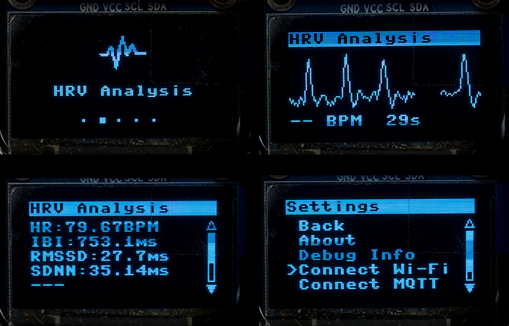
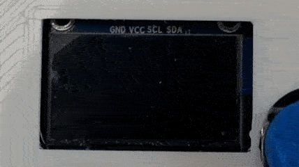
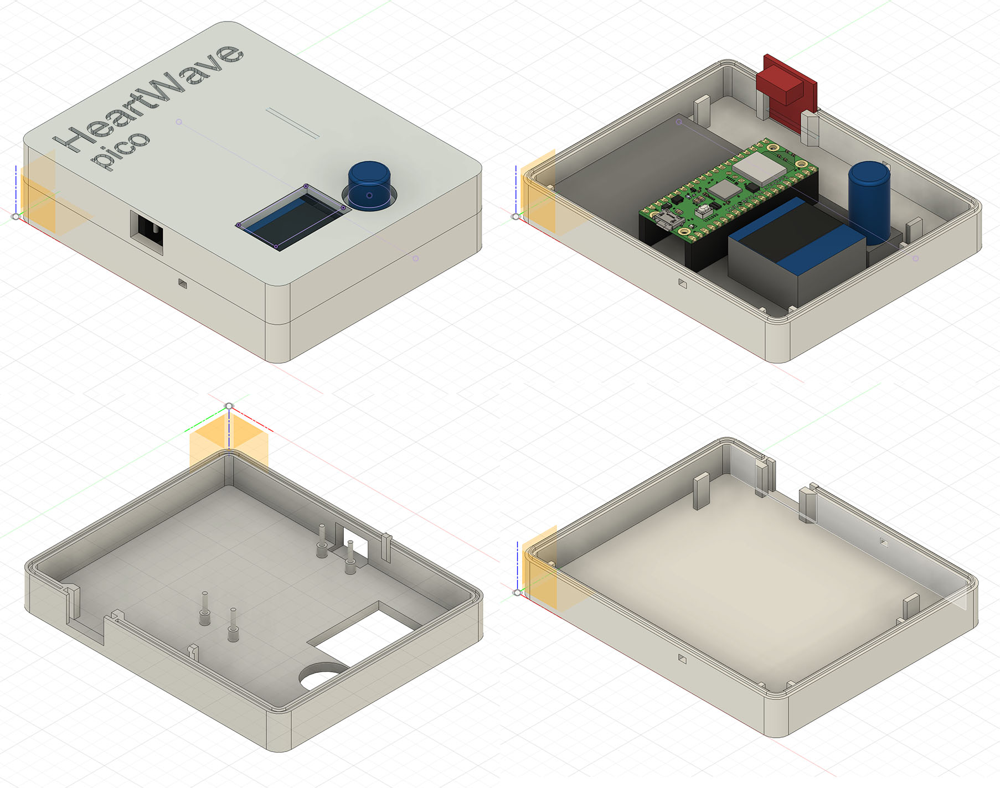
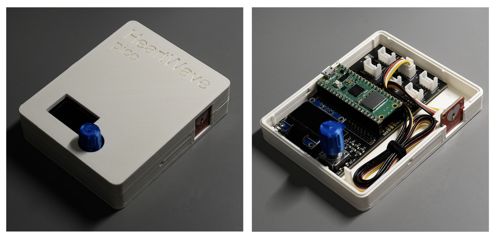
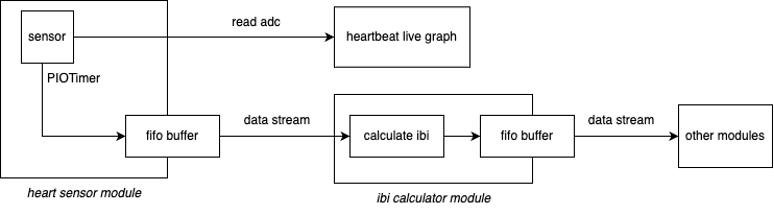
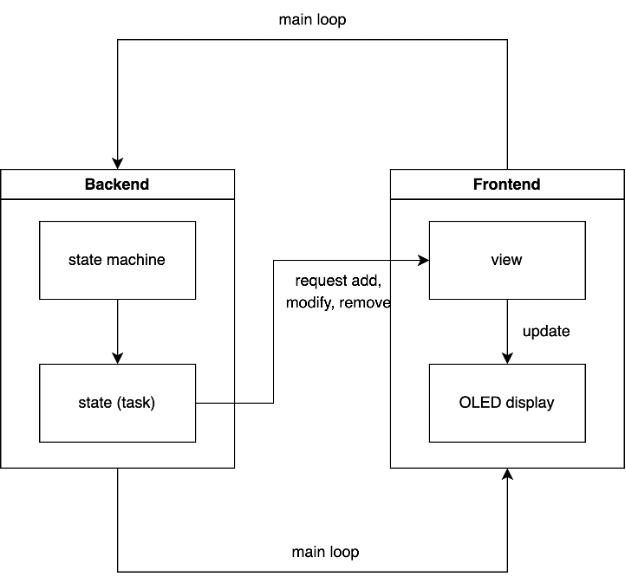
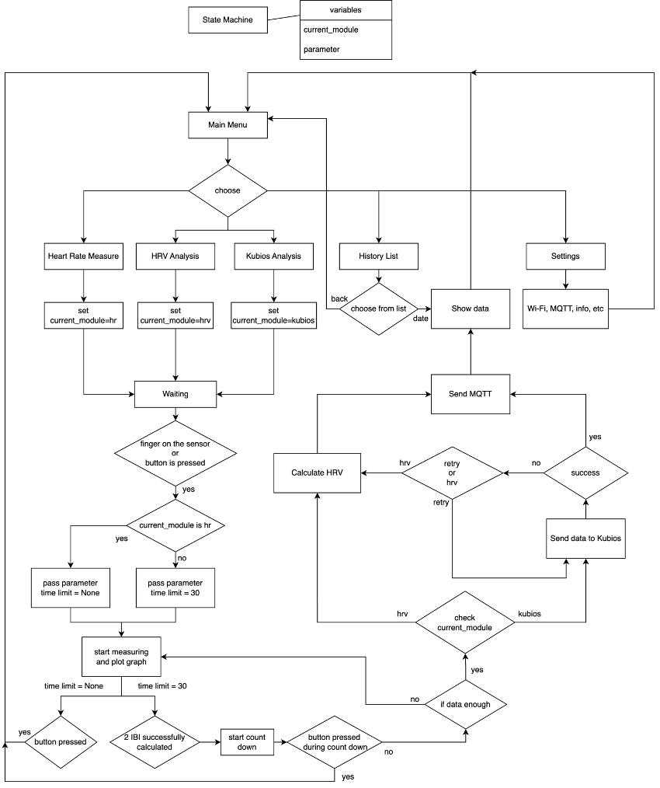

# Heartwave Pico

Heartwave Pico is a portable Heart Rate Variability (HRV) analysis device based on Raspberry Pi Pico W. It uses Photoplethysmography (PPG) technology to measure and analyze users' heart rate and heart rate variability, providing real-time health monitoring.



## Features

- Real-time heart rate monitoring

- Heart Rate Variability (HRV) analysis

- Integration with Kubios Cloud service for advanced HRV analysis

- User-friendly interface with OLED display

- Data transmission via MQTT protocol

- Local data storage and history viewing

- 3D-printed case for enhanced portability and user experience, see [case design](#case-design)

## Showcase




*User Interface*



*User Interface in Action*


## Installation

### Components Needed
- Raspberry Pi Pico W
- Crowtail Pulse Sensor
- OLED Display (SSD1306 I2C 128x64 pixels)
- Rotary Encoder

### Hardware Setup
1. Connect the Crowtail Pulse Sensor to GP26 (yellow wire). White wire is not used.
2. Connect the OLED Display to GP14 (SDA) and GP15 (SCL).
3. Connect the Rotary Encoder to GP10 (CLK), GP11 (DT), and GP12 (SW).

**Note:** All components should be powered by 3.3V and connected to GND.

### Software Setup

1. Install `mpremote` if you don't have it installed.

   ```
   pip install mpremote
   ```

2. Clone the repository

   ```
   git clone --recurse-submodules https://github.com/shengt25/heart-wave-pico.git
   ```

3. [Optional] Configure settings:
   - If you want to use MQTT, open and edit the `config.json` to set up the WiFi: `wifi_ssid` and `wifi_password`, `mqtt_broker_ip`
   - If you want to use Kubios Cloud, set up WiFi as above and: `kubios_apikey` `kubios_client_id` and `kubios_client_secret`.
   - If you're using different pins than those specified in the hardware setup above, open `src/hardware.py` and modify the default parameters in `__init__` functions for classes accordingly.
4. Connect the Raspberry Pi Pico W to your computer via USB and run the script:

   for Linux or MacOS:

   ```
   cd Heart-Wave-pico && ./install.sh
   ```
   for Windows:
   
   ```
   cd Heart-Wave-pico && .\install.cmd
   ```
5. Restart the Raspberry Pi Pico W and it should be ready to use.

**Note:** To ensure a faster system booting, MQTT will not be connected by default, because if it will block the whole system for about 15 seconds if the broker is not available. You can connect it manually in the settings menu, if the Wi-Fi and MQTT broker is correctly set up.

## Usage

1. The device will start automatically when connected to power.
2. Navigate through the main menu using the rotary encoder, push to select.
3. Select the desired mode: heart rate measure, hrv analysis, kubios analysis, history or settings

## Acknowledgments

- Raspberry Pi Foundation
- [Kubios Cloud](https://www.kubios.com/kubios-cloud/)
- Teammates [Minimal-Alexi](https://github.com/Minimal-Alexi) and [VitaliiVIP ](https://github.com/VitaliiVIP)contributed to this project
- Joseph (project engineer) - For providing the custom expansion board

## Appendix

### Case Design



*Case Design in CAD*



*Case 3D Printed*

### Flowcharts



*Main Data Flow*



*Task Scheduling*



*Program Structure*
